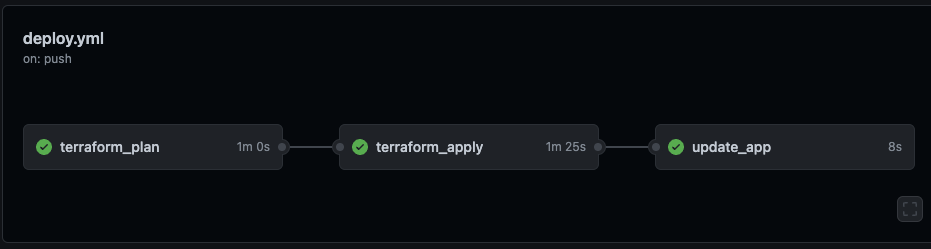

# William Chrisp Pathways Dojo Infra Node Weather App Infrastructure

This repository is used in conjunction with the Contino Infra Engineer to Cloud Engineer Pathway course delivered in Contini-U. It is the main infrastructure half of the weather app and the app half is located in the following repository. 
https://github.com/williamchrisp/dojo-weather-app

It includes and supports the following functionality:
* Dockerfile and docker-compose configuration for 3M based deployments
* Makefile providing Terraform deployment functionality
* GitHub workflows for supporting Terraform deploy and destroy functionality

<br> 

## Running Locally

The provided `makefile`, `dockerfile` , and `docker-compose.yml` files work together to create a docker container which is used to run Terraform deployments and other supported commands. It expects AWS account credentials to be passed as environment variables.

Please ensure the following variables are exported locally.
If you are not using temporary credentials you do not require AWS_SESSION_TOKEN
```
export AWS_ACCESS_KEY_ID=
export AWS_SECRET_ACCESS_KEY=
export AWS_SESSION_TOKEN=
```

You can use the following commands

### Terraform
Terraform `init`, `validate` and `fmt` are run for each of the `make` commands below.

Deploying Terraform environment locally - creates tfplan file during plan as input to apply. Apply is auto-approved.

```
make run_plan
make run_apply
```

Destroying Terraform environment locally. Destroy plan is speculative. Destroy apply is auto-approved.

```
make run_destroy_plan
make run_destroy_apply
```

### AWS

To run a simple aws command, ensure you have set your in your local environment and run the following

```
make list_bucket
```

This is based off 3 Musketeers, for more information on 3 Musketeers deployment method, visit the official site here. https://3musketeers.io/

<br> 

## GitHub Actions / Workflows
The following workflows are provided in this repository. These are located under `.github/workflows`.

| Workflow | Description | Environments | Trigger
|----------|-------------|--------------|--------|
| deploy.yml | This workflow will re trigger a deploy workflow in the app repository. This ensures that the app downstream will get all updates to the main infra. Actually deployments are protected by approvals in the app repository. | N/A | on.push.branch [master] |

Note: Pushing to `master` branch will trigger Terraform (TF) deploy.

Additionally, ONLY changes to the following files and paths will trigger a workflow.

```
    paths:
      - 'modules/**'
      - '**.tf'
```

<br>

### deploy.yml workflow


<br>

Pushing to master is not permitted and the current workflow is to create a branch and make a pull request with the new feature you want to add. Once this is approved and merged this will trigger the app repositories deploy workflow.

<br> 

## GitHub Secrets
The only secret the repository requires is a ACCESS_TOKEN. You are required to make one for this repo and add it to your repository secrets.
https://docs.github.com/en/authentication/keeping-your-account-and-data-secure/creating-a-personal-access-token


<br>

## Terraform IaC
The Terraform environment is includes the following `providers.tf`, `meta.tf`, `variables.tf` and `main.tf` which leverages the `.tf` modules created in `modules/`. 

The `modules` folder organises the `.tf` files called by `main.tf`.

<br>
The following Inputs are located in the variables.tf file under the root folder. Adjusting the default values allows you edit the outcome of the terraform file. These will not be used unless you are deploying this stack locally or by itself.

### Inputs
---
<details open>
  <summary>Click to expand</summary>


| Name | Description | Type | Default | Required |
|------|-------------|:----:|:-----:|:-----:|
| vpc_cidr | Specifies the cidr for the vpc | string | `"10.0.0.0/24"` | yes |
| public_subnets | Specifies the public subnets in a list | list(any) | `"10.0.0.0/28", "10.0.0.16/28", "10.0.0.32/28"` | yes |
| private_subnets | Specifies the private subnets in a list | list(any) | `"10.0.0.64/26", "10.0.0.128/26", "10.0.0.192/26"` | yes |
| bucket | S3 bucket name - must be globally unique | string | `"williamdojoapp"` | yes |
| tags | Tags to be applied to AWS resources| map(string) | `Owner   = "williamchrisp", Project = "node-weather-app"` | yes |


</details>

<br> 

<!-- OUTPUTS -->
### Outputs
---
<details open>
  <summary>Click to expand</summary>

| Name | Description |
|------|-------------|
| bucket_name | The name of the S3 Bucket. | |
| bucket_name_arn | The ARN of the S3 Bucket. | |
| vpc_id | VPC id required for applications using this module |


</details>

<br>

### TF State Files
AWS S3 is used to host the TF state files. This is hosted by s3://pathways-dojo, you can change this to whatever pre-created bucket. You will need to update the name of the state file in the `meta.tf` file replacing `williamchrisp` with your username.
*`This will only be used when running locally`*

```
terraform {
  required_version = ">= 0.13.0"
  backend "s3" {
    bucket = "pathways-dojo"
    key    = williamchrisp-tfstate
    region = "us-east-1"
  }
}
```

Happy Hacking!
